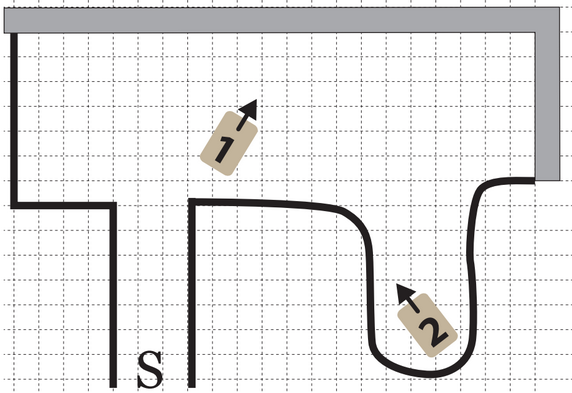

# SAE 15 : Robot autonome - Montagnes et Falaises  

## Résumé  
Cette **Situation d’Apprentissage et d’Évaluation (SAÉ)** consiste à développer les algorithmes et programmes permettant à un robot de se déplacer de façon autonome dans des environnements variés.  

Nous avons choisi de nous concentrer exclusivement sur le **Challenge #3 : Montagnes et Falaises**.  

---

## Challenge #3 : Montagnes et Falaises  

### Énoncé du défi  
Le robot démarre dans une arène de 2 m x 1,5 m délimitée par :  
- Des **murs** représentant des montagnes.  
- Une **ligne au sol** symbolisant le bord d’une falaise.  

L’objectif est de guider le robot jusqu’à la sortie (point **S**) :  
- Sans toucher les murs.  
- Sans franchir la ligne de la falaise.  

Le robot utilise son radar de proximité et son détecteur de lignes pour :  
- Explorer l’arène.  
- Trouver et atteindre la sortie en partant d’une des deux positions initiales possibles (1 ou 2).  

### Fonctionnement attendu  
1. **Initialisation :**  
   - Le robot est placé en position (1) ou (2) et orienté selon la Figure 9.2.  
   - Une LED s’allume en rouge pour indiquer que le robot est en attente.  
   - L’utilisateur appuie sur la touche `OK` de la télécommande pour démarrer.  

2. **Déroulement :**  
   - La LED passe au vert et le robot commence à se déplacer.  
   - Le chronomètre démarre au lancement et s’arrête lorsque le robot atteint la sortie (**S**) sans faute.  

3. **Conditions de réussite :**  
   - Le robot ne doit **pas** toucher les murs.  
   - Le robot ne doit **pas** franchir la ligne de la falaise.  
   - L’algorithme doit permettre au robot de sortir rapidement, quelle que soit la position de départ.  

### Fonctionnalités optionnelles  
**Détection automatique du seuil de luminosité :**  
   En plaçant les capteurs de luminosité sur une ligne, puis en appuyant sur `*`, le robot définit le seuil de détection de ligne par rapport à la luminosité actuelle.  

---

## Structure du projet  
### Code et fichiers  
- `lightsensor.h` : Classe pour gérer le capteur de lignes et calculer les distances.  
- `carMotors.h` : Classe pour gérer les moteurs du robot.  
- `ultrasonic.h` : Classe pour gérer le capteur ultrasonique pour les distances.  
- `bot.ino` : Programme principal implémentant la logique de déplacement et les interactions avec les capteurs.  

### Capteurs utilisés  
1. **Radar de proximité :**  
   - Pour détecter et éviter les murs.  
2. **Détecteur de lignes :**  
   - Pour identifier les bordures de la falaise.  

---

## Utilisation  
1. Téléversez le code sur votre robot à l’aide de l’IDE Arduino.  
2. Placez le robot dans l’arène (position initiale 1 ou 2).  
3. Activez le robot via l’interrupteur d’alimentation.  
4. Calibrez la détection des lignes en plaçant les capteurs de lumière sur une ligne, puis en appuyant sur `*`.  
5. Appuyez sur `OK` de la télécommande pour commencer.  

---

## Objectifs pédagogiques  
- Mettre en œuvre des algorithmes autonomes complexes.  
- Maîtriser l’utilisation des capteurs du robot.  
- Optimiser les performances dans un environnement contraint.  

---

## Auteurs  
Projet réalisé dans le cadre de la SAÉ 15, avec un focus exclusif sur le défi 3.  
